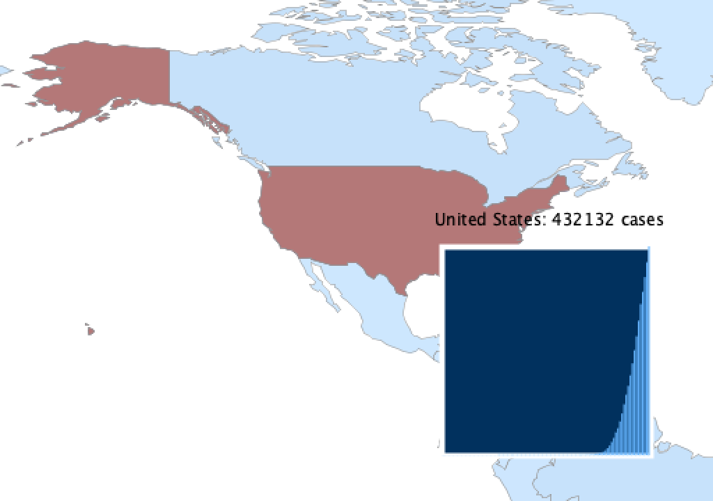

# Covid-19 Interactive Country Case Map and Cumulative Cases Graphs

## Description:

This project uses the library found at [geoMap](https://www.gicentre.net/geomap) and the data found at the [European Centre for Disease Prevention and Control](https://ourworldindata.org/coronavirus-source-data) to make a map that shows the amount of coronavirus cases in a country and a graph showing the cumulative cases when you mouse over a country.

## Video [Here](https://youtu.be/jKFioZ_PGDY)

## Some Images:

