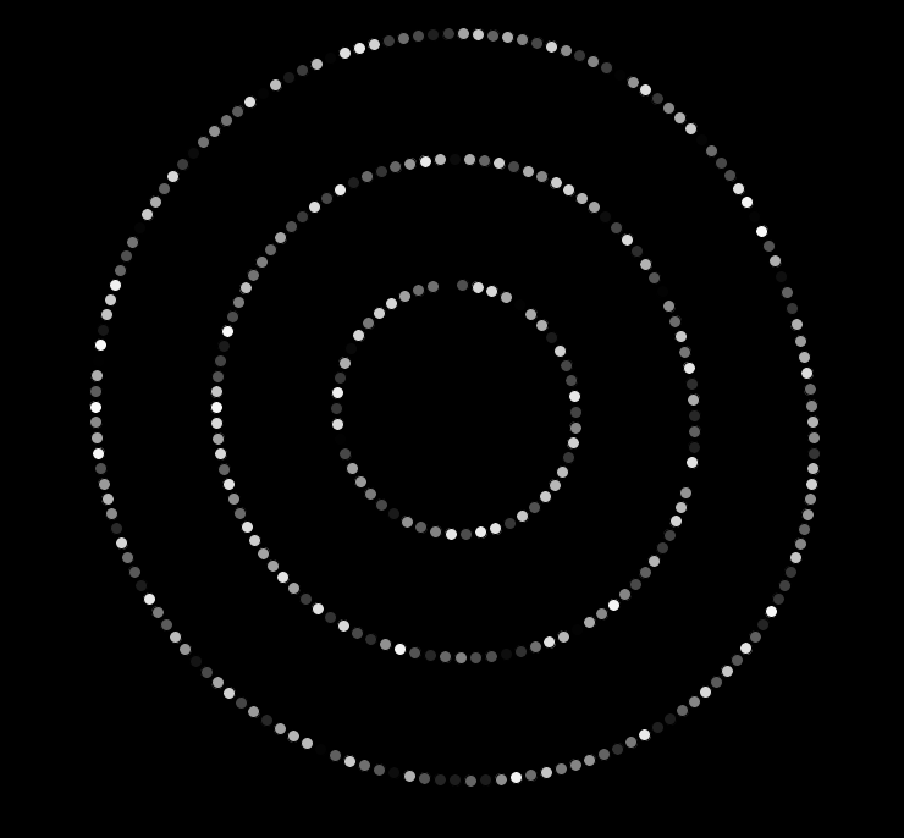

# Gravity Beads!

## Description:

This project was inspired by Aaron Sherwood's [website](http://aaron-sherwood.com/), where the name "Aaron Sherwood" is made of many little balls that gravitate away from the mouse.

I used a ball class that has a position "center", and that starts out at a random position. The ball always gravitates towards one position and away from the mouse. The positions (or "centers") of the balls are arranged in three concentric rings around the center of the canvas. These rings can be played with using the mouse, and the balls move around independently as the mouse comes closer or further from them. Only 70 lines of code.

## Video [Here](https://youtu.be/L4dyEO2RrpI).

## Some Images:

