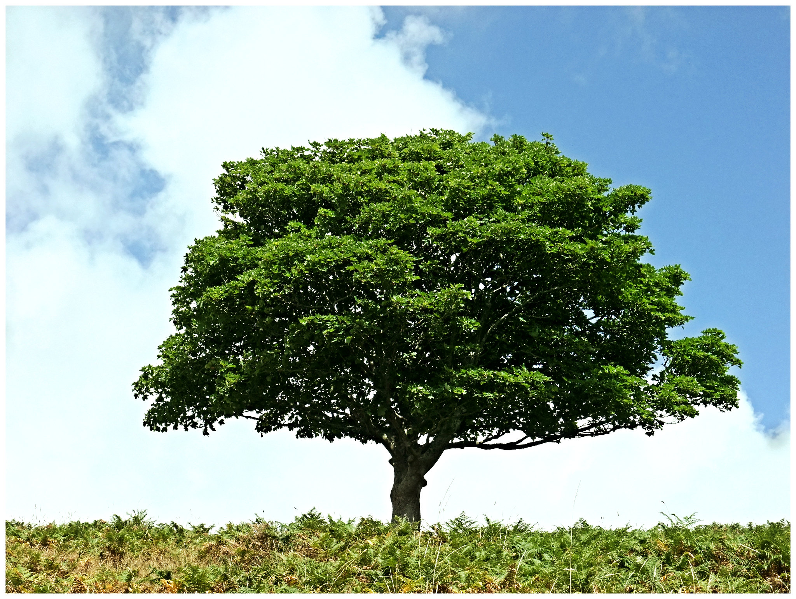
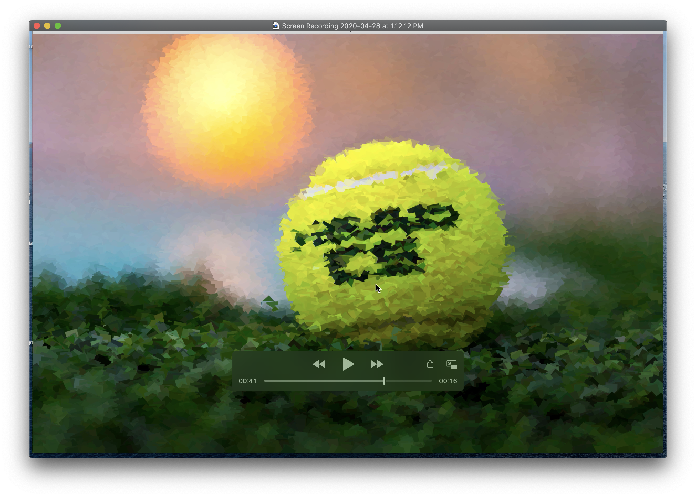

# Image Pixelizer!

## Description

This project basically takes an image and lets you play with it. 
It goes through every 50-100th pixel and makes a rectangle at that location, of the same color as the pixel. That rectangle is rotated at a random angle, and when the mouse goes past it, it rotates. The rotation it makes is with an acceleration, to make it a smoother rotation.

## Video [Here](https://youtu.be/lr2n0sUx7R0)

## Some Pics:

1. Tree

BECOMES

2. Ball

BECOMES

