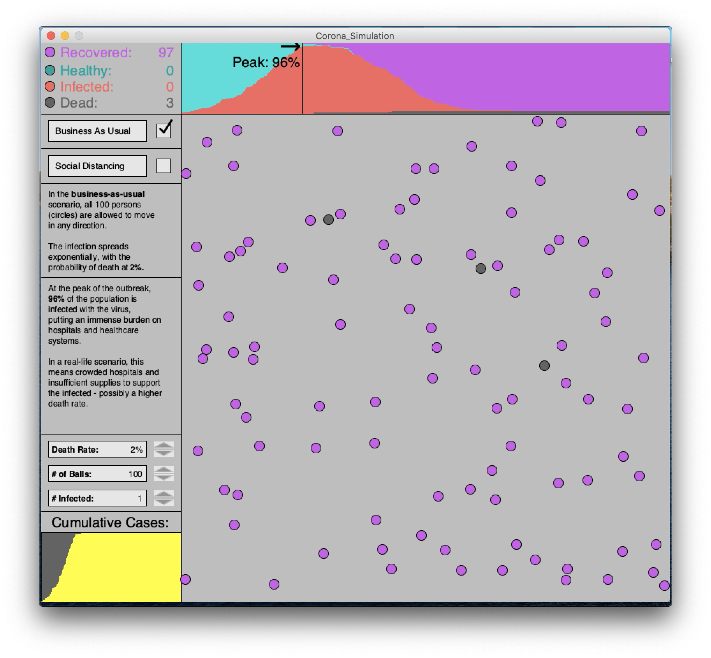
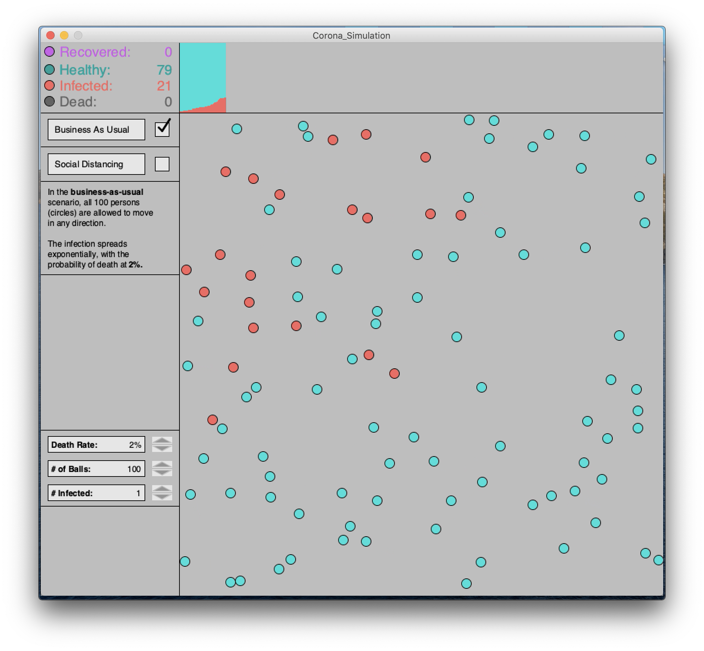

# Coronavirus Simulation

## Description:

I got inspired by a Washington Post article ([here](https://www.washingtonpost.com/graphics/2020/world/corona-simulator/?itid=hp_hp-top-table-main_virus-simulator520pm%3Ahomepage%2Fstory-ans)) that showed how epidemics spread, and how social distancing can flatten the curve. I got really excited because I knew this could be done with processing as well, so I started watching tutorials on how to make classes and arrays of objects in processing. It took me an afternoon to get the basics working, and I spent another week adding features, like changing the death rate (which is set by default to 2%, the estimated coronavirus death rate), and the intial number of infected balls.

The simulation is basically 100 balls on the screen. One of them is infeced, and they are all moving in a random direction. If an healthy ball touches an infected ball, the healthy ball becomes infected. In social distancing mode, 80% of the balls are stationary. You can restart the simulation by clicking on either of the checkboxes, for social distancing or for business as usual.

I had too many issues to list, but I can explain a few. One was that the balls kept bouncing back and forth on the edge of the screen. I "solved" this at first by adding a timer, so that the velocity would only be reversed every 50 ms - enough time for the ball to leave the edge. But this didn't help as balls would bounce against each other back to the edge within the 50ms and then get stuck. I finally solved it by saying only reverse the velocity direction if the velocity is towards the edge and not away from it. 

Another problem was that I coudn't figure out how to realistically get the balls to bounce off each other without using complicated math and physics stuff. So I decided to use the difference between the two balls' x coordinates and y coordinates as the new x and y velocities, except in the opposite direction, so they always bounce off each other at 90˚.

## Video:

Link [here](https://youtu.be/GZvLz4ygzyg) and [here](https://youtu.be/w98tx4X2Gzg).

## Images:

