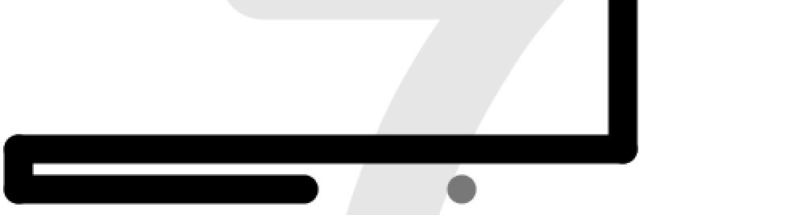
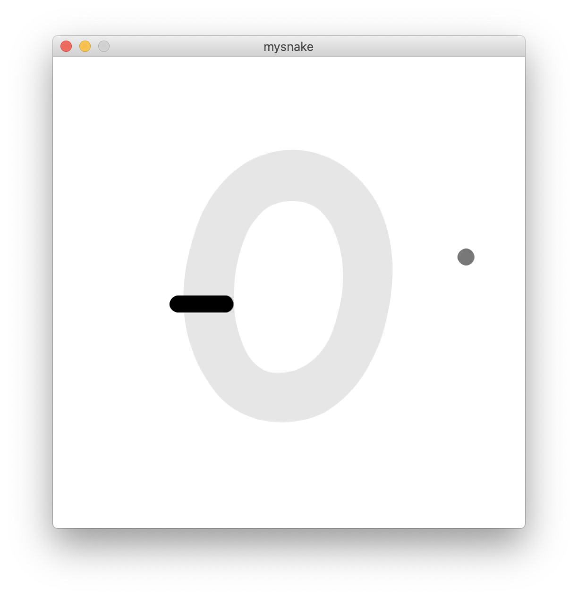
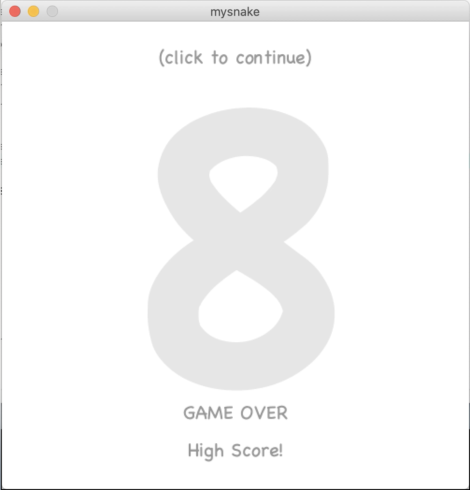
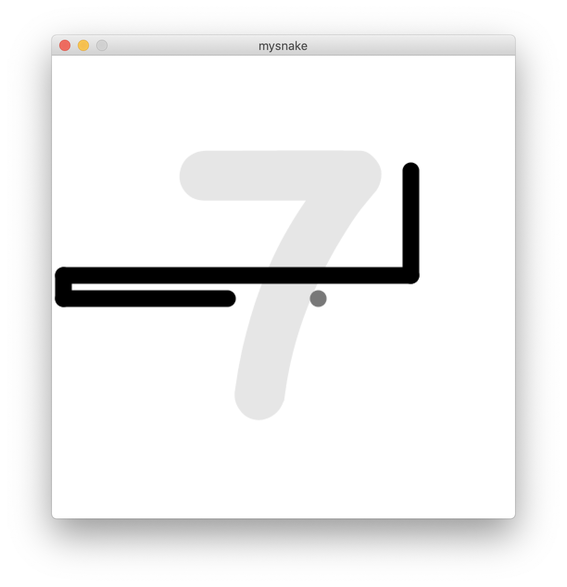

# SNEK GAME!!!

## Description:

I decided to make a snake game as well, so much harder than I expected. Basically it draws some lines and adds a point every time the head turns. I had to make three nested sub-classes: mouse, the thing the snake eats; point, a position in the snake's body; and position, a position in the 20x20 grid of the snake game, used to stop the mouse from spawning on the snake, and to check if the snake has crashed into itself.

## Video [Here](https://youtu.be/AOmY0WUm_2Y) and [Here](https://youtu.be/xm3vLu4zgL4)

## Photos:

