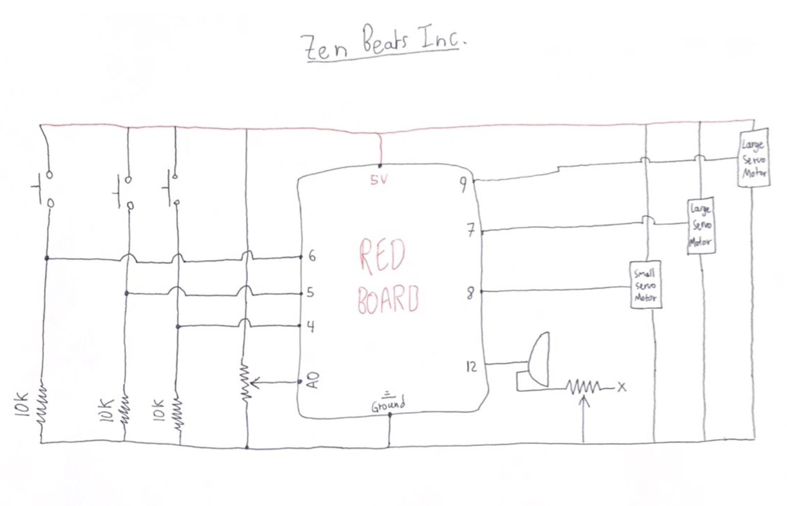
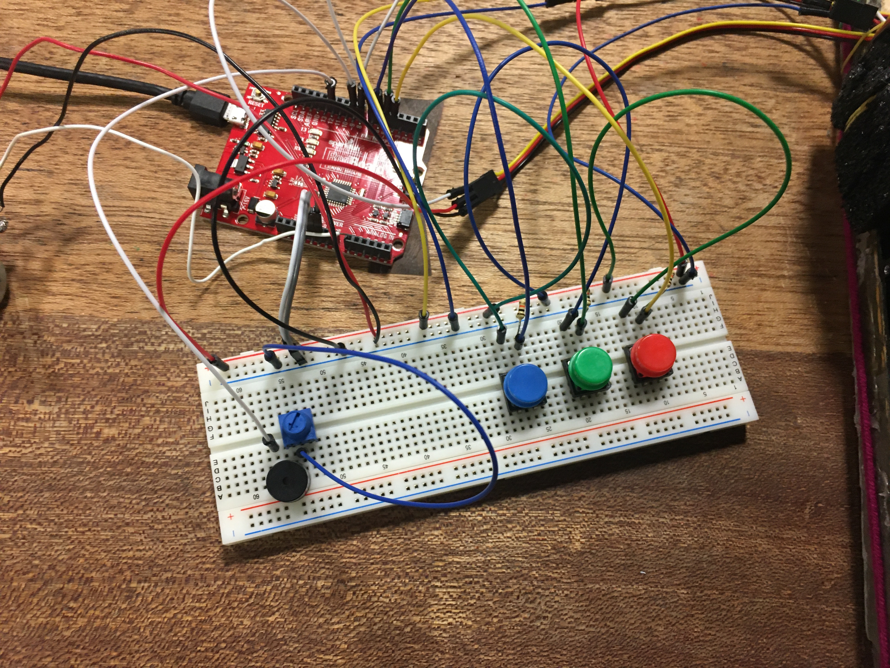
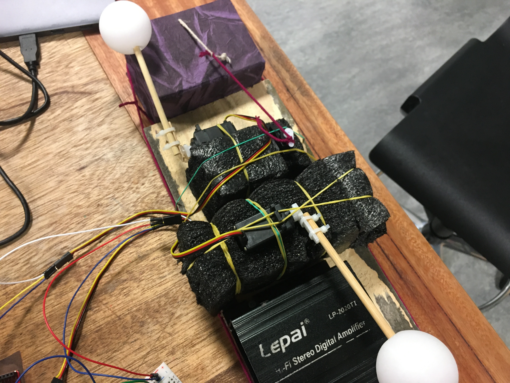

# Zen Beats Inc.

### About:

Zen Beats Inc. is an integrated system that creates a 4/4 time signature beat and allows the user to alter its speed and play music to it. The beat is created with two ping-pong balls each on a stick. One hits a metal beam 3 times and then other hits a cardboard box once. The time between hits is controlled by a potentiometer. Meanwhile, the user can play some music in the background, using three wires that play different sounds (C, D, and E). As the beat can be controlled by the potentiometer, you can change it to work as a mentronome for your music. 

### Problems and Solutions:

The button feedback was really slow, so I made a function that would detect a button push and then play tones from it. I put this function next to every delay call, so that it would be as responsive as possible.

### Extensions:

Adding two more buttons for the notes would allow many more songs to be played, so that would be very useful in future. I would also like to code it without using the delay() function, as this would allow more responsive button feedback.

Video: [Link](https://www.youtube.com/watch?v=nBwyTpwN0DU)

### Circuit Diagram:

### Some Images:

