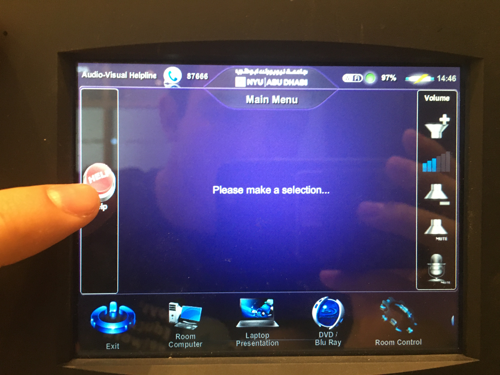

### Interactive Observation 

I observed an instance of interactive media at the library. In one of the library rooms, they have a touchscreen controller in the wall that controls: 
1) The level of light in the room 
2) The projector/projecting screen
3) The level of the window blinds

The controller is touchscreen and connects to the wall, where it charges, and it can be removed and controlled remotely. The interactive capability of the device is augmented by the fact that it is touchscreen and intuitive.

Here is a photo:

