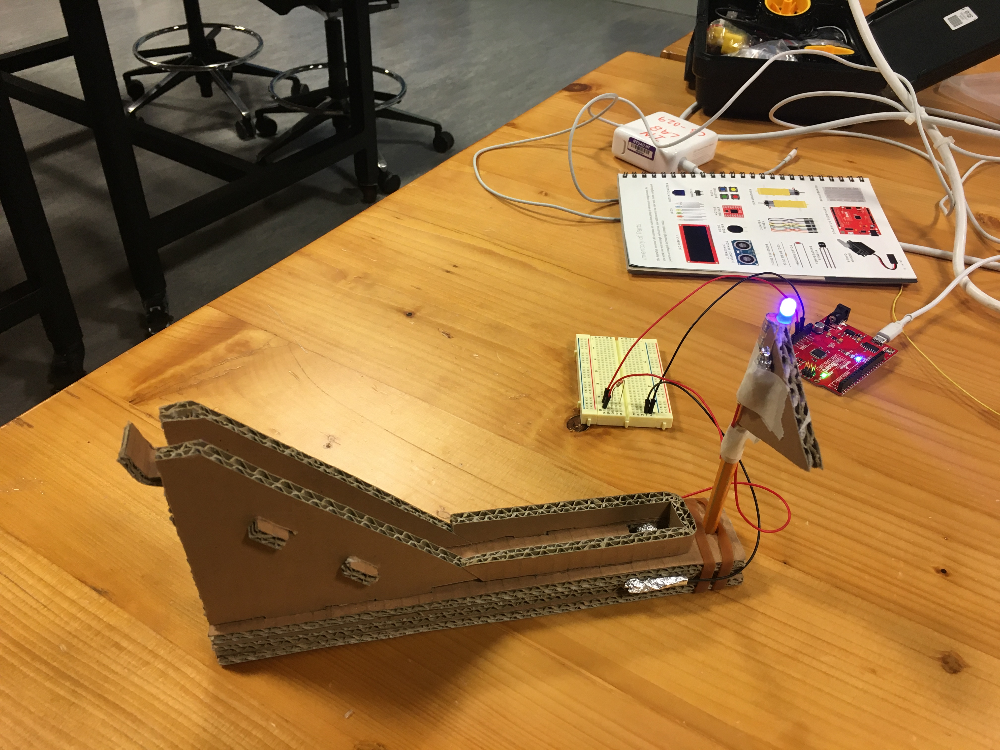
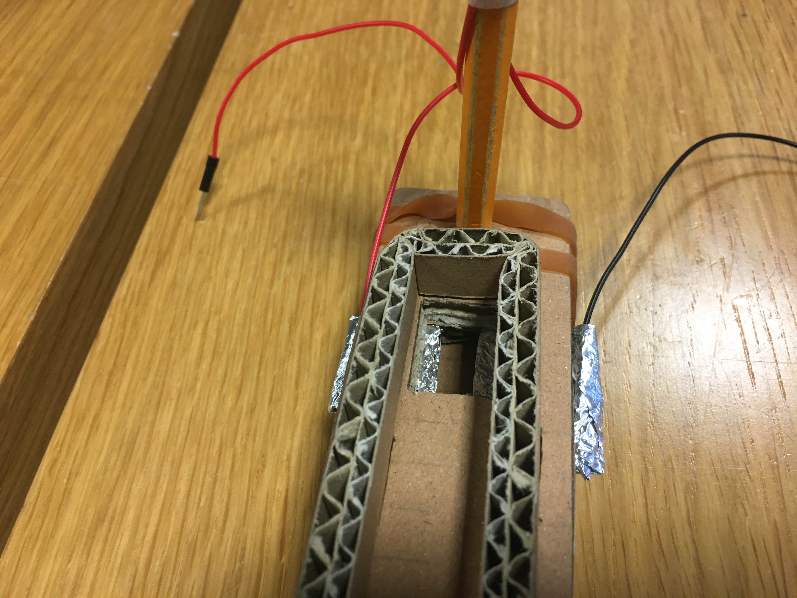
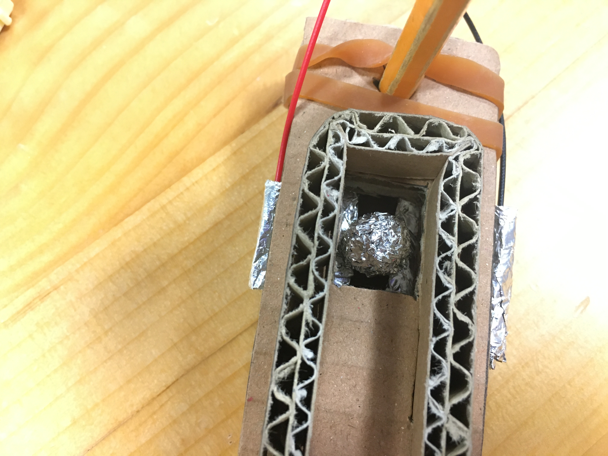

Daniel de Beer
4th February 

# Description of my Hands-Free Switch

The inspiration for my hands-free switch came from gravity and potential energy. I decided to made a cardboard ramp where a foil ball would roll down and connect two other pieces of foil. This completes the circuit and makes the blue LED light up. The ramp is made out of only cardboard, precision cut with tabs that make it fit together. This ensures that the product is completely mono-material and recyclable. The LED is set on top of a flag on the other side of the hole that the foil ball rolls into. 

### Here are a few images of my switch:

*The Setup*

*Switch Mechanism*

*Ball in Hole*

# Here's a video, too:

[Link](https://drive.google.com/open?id=1SpkBI5z4eP1R1qi2PJJiYI1qF0Escddd) 
