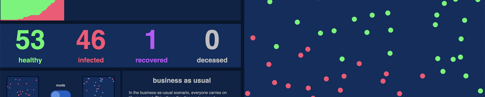
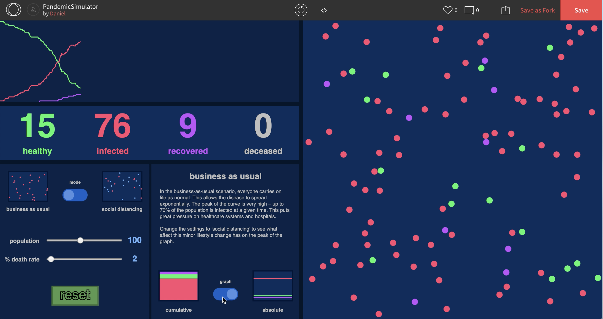
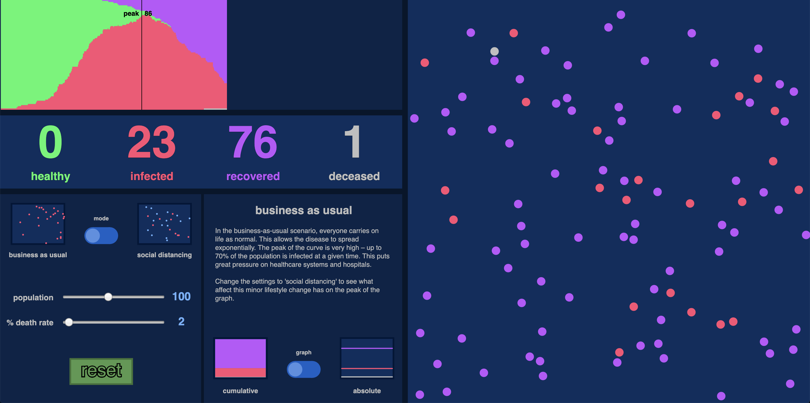

# [PandemicSim](https://www.openprocessing.org/sketch/891417)
### *Final IM Project using OpenProcessing*

## Overview:

My project consists of 100 little balls on a screen, plus a user interface. One of those balls is "infected", the other 99 are "healthy". Each ball moves in a random direction but fixed velocity. An infected ball can recover after a certain number of seconds. When a healthy ball bumps into an infected one, it becomes infected. As can be expected, the "infection" spreads exponentially.

What excites me about this project is that the concept is quite simple, but it produces delightful and interesting results out of a system that is too complex to orchestrate yourself sequentially. You could never tell those 100 balls what to do every frame. Instead, you tell them how to behave, and then watch the magic happen. Maybe the "infected ball" won't touch any others, and it'll end right there when it "recovers". Maybe they'll all become infected. Maybe half will. Most of the time, however, you'll see a logistic curve in the cumulative number of infections, mirroring what happens in real life.

The project is meant to visually demonstrate the benefits of social distancing in a post-Covid-19 world. It was inspired by an [article](https://www.washingtonpost.com/graphics/2020/world/corona-simulator/?itid=hp_hp-top-table-main_virus-simulator520pm%3Ahomepage%2Fstory-ans) from the Washington Post that showed a very similar model, except without the ability to change the settings of the simulation. I wanted to create something visually pleasing and modern looking that would embody the reasoning behind social distancing as a way of slowing the spread of the virus.

I added the ability to change the population size and death rate to make the simulator representative of pandemics in general. The default setting is at the estimated Covid-19 death rate of 2%. I also added an automatic peak finder that would show in the graph where the peak of the simulation outbreak occurred. This helps demonstrate the stark difference between the social distancing and business as usual models.

## Personal Statement:

As I mentioned earlier, I got the idea from a Washington Post article. I saw this article ages ago, and I got really excited and dreamed of making my own simulation. When we began using object-oriented programming in Processing I realized that it might actually be possible to make a very similar simulation. I got started and spent a weekend making one in processing. It had a bit of a Windows 95 feel to it, my friends told me, so I decided for my final I wanted to make it in OpenProcessing, with a completely different aesthetic.

## Problems and Solutions:

## Video [Here](https://youtu.be/YQt4y0cIees)

## Some images:

