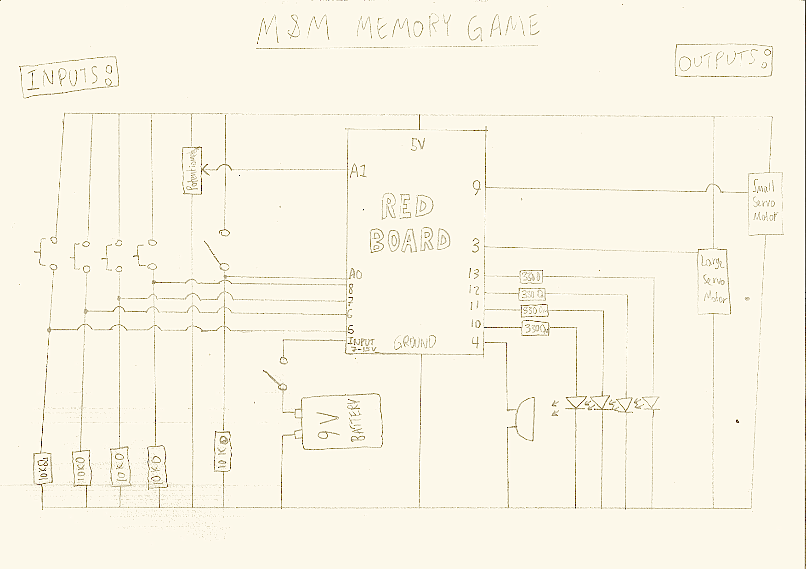

# Midterm Project: _M&Ms Memory Game!_

## Original Idea for Project

My original concept was simple: a tactile memory game that would incorporate multiple LED outputs and inputs, and provide some kind of reward if the user wins the game. I wanted to have a setup of four buttons (different colors) and a potentiometer on a box, and opposite to this four LEDs (of corresponding color) and a servo-controlled potentiometer head. The LED's flash and the potentiomenter turns in a randomized pattern. If the user mimics the pattern correctly, M&Ms come out of a hole in the side of the box. This is enabled with a servo that sweeps a small gate open and then shut. There is also a fast-slow switch and an on-off switch on top of the box.

## Getting Started

I started by making a practice run using four LEDs, four buttons and the breadboard that came with our kits. I set up the circuit and then wrote the code. The code essentially made a randomized array of numbers between 10 and 13 of a preset length, and then flashed the LEDs connected to the corresponding pins. If you clicked the right buttons, it would make all the LEDs flash, meaning you got it right. If you didn't get the input right only the red LED would flash. 

I split the code into three sections or "modes". I had a variable called mode and it was either 0, 1 or 2. Three if statements would activate certain parts of the loop function if the mode was correct. This allowed me to loop through specific parts of the code exclusively.

## Problems and Solutions

I decided that with this preparation, I was ready to start making my box to house the M&Ms and all electronic components. I first shooped around for pieces that I could make a box out of, but nothing seemed effective enough. I wanted to use wood, but there wasn't quality enough wood around to use. I decided to laser-cut a box, and I used large pieces of scrap acrylic to make a T-joint box with holes of the right size to fit my components.

I gathered all the buttons, switches, LEDs and one potentiometer, and I then began soldering a breadboard to convert my solderless design into a soldered product. This took incredibly long, especially because I was using threaded core wire which was hard to solder. I attached everything to the components. One of the problems was that my potentiometer didn't fit between the four buttons, so I had to cut part of it to the right shape.

After finishing the breadboard I ran into a huge problem - nothing was working and my speaker inside kept saying the input was wrong even though I hadn't inputted anything. This was because I hooked up the LED part of the push buttons instead of the buttons themselves, so I had to undo each soldered button and re-solder it in the right position.

Making the M&M housing unit was super simple, but it took a long time to figure out how I wanted the gate to open and close. The servo I wanted to use kept moving when the Arduino started up, so I tried to use a solenoid. I soldered the circuit with a transistor and everything, but it didn't work possibly because my voltage wasn't high enough. I decided to use the servo and call the few M&Ms that came out at the start a "feature", not a bug. 

## Current Prototype

Youtube video [Here](https://youtu.be/CkLPHmC3wF0)

Everything works as intended, but the servo and potentiometer input don't because I didn't have enough time to do testing and calibration with them. 

## Evaluation and Extensions 

I really really wanted to do a few things:

1) Take the speaker and attach it to the lid of the box, with a few holes, so we can actually hear it
2) Use a breadboard shield connector with the Arduino so that the pins don't fall out
3) Fix the M&M holder so that they don't get stuck as easily
4) Actually implement the potentiometer input and servo output
5) Make the array size dynamic between 6 and 10 different outputs, so that it's not always the same length of things to memorize

These are all very do-able, I just didn't have the time, and I really regret this. I hope I can re-visit it at some point when I have time and make it very nice. However, I did have time to do what was done properly, to the extent of my knowledge. For example, the potentiometer and switches were both put in with the little thing that pokes out so that it doesnt twist or move around on the lid.

## Circuit Diagram

## Some Images

### M&M Gate:

### M&M Output hole:

### M&M Housing Unit:

### Speaker and Breadboard:

### Input/Output Panel (Lid):

### Buttons with Potentiometer:

## Code:

        /* Daniel de Beer
           Introduction to Interactive Media
           Midterm Project: "M&M Memory Game"
           March 2020
        */
        
        #include <Servo.h>    // Servo Header File
        
        // This servo was never actually realized, but in principle it would control the knob the user would have to copy
        Servo knobServo;
        const int knobServoPin = 3;
        // ____
        
        
        // Implement mnm output servo 9 - this servo opens and closes the mnm gate.
        Servo mnmServo;
        const int mnmServoPin = 9;
        // ----------------------------------
        
        
        // This is the input pin for the fast/slow mode switch
        const int fastSlow = A0; // CHECK
        int delayTime; // A variable for the different times
        
        
        // Also never realized - this potentiometer input would have to mimic the servo output. 
        const int potPin = A1;
        int potPos = -1;        // Variable to store potentiometer input
        int prevPotPos = -1;    // Variable to store previous potentiometer input
        unsigned long potTime = 0;    // Time between inputs
        // ----------------------------------
        
        
        // LED PINS
        const int redLed = 13;
        const int greenLed = 12;
        const int blueLed = 11;
        const int yellowLed = 10;
        // ----------------------------------
        
        // BUTTONS
        const int redButton = 8;
        unsigned long redTime = 0;
        int LRBS = LOW;
        
        const int greenButton = 7;
        unsigned long greenTime = 0;
        int LGBS = LOW;
        
        const int blueButton = 6;
        unsigned long blueTime = 0;
        int LBBS = LOW;
        
        const int yellowButton = 5;
        unsigned long yellowTime = 0;
        int LYBS = LOW;
        // ----------------------------------
        
        int pressedButton = 0; // Store which button has been pressed
        
        int mode = 0;   // The mode variable
        
        const int sizeOfArray = 6;    // The number of flashes / outputs for the game
        
        int test[sizeOfArray], input[sizeOfArray], placeInArray = 0;    // Arrays for inputs/outputs
        
        
        void setup()
        {
          knobServo.attach(knobServoPin);  
          knobServo.write(90);
        
          mnmServo.attach(mnmServoPin);
          mnmServo.write(90);
        
          randomSeed(analogRead(0));    // Seed for random array input 
        
        
          // PINMODES
          pinMode(redLed, OUTPUT);
          pinMode(blueLed, OUTPUT);
          pinMode(greenLed, OUTPUT);
          pinMode(yellowLed, OUTPUT);
        
          pinMode(redButton, INPUT);
          pinMode(blueButton, INPUT);
          pinMode(greenButton, INPUT);
          pinMode(yellowButton, INPUT);
        
          pinMode(fastSlow, INPUT);
        
          pinMode(potPin, INPUT_PULLUP);
          // --------------------------
        
          Serial.begin(9600);
        }
        
        void loop()
        {
         
          if (mode == 0)         // This is the start mode for the memory tester
          {
            placeInArray = 0;     // Set our position in the tester array to 0
        
            for (int i = 0; i < sizeOfArray; i++) // fill the test array with random pins between 10 and 13
            {
              test[i] = random(10, 14);     // Would be 15 & 16 too if the servo was included
            }
        
            if (digitalRead(fastSlow) == HIGH)    // Setting to fast/slow mode
            {
              delayTime = 500;
            }
            else
            {
              delayTime = 1000;
            }
        
            mode++;               // increment mode to the next one
          }
        
        
          if (mode == 1)               // in this part the LEDs are blinked on and
          {                            // off for the user to memorize
        
            // NEED TO ADD:
            // Servo output - full right to left can be 14, left to right 15, etc.
        
            for (int i = 0; i < sizeOfArray; i++)
            {
              if (test[i] < 14)           // Blink the relevant light
              {
                digitalWrite(test[i], HIGH);
                delay(delayTime);
                digitalWrite(test[i], LOW);
                delay(delayTime / 5);
                continue;
              }
        
              if (test[i] == 14)          // Sweep to 20 degrees and back
              {
                for (int i = 90; i >= 20; i--) {
                  knobServo.write(i);
                  delay(delayTime / 100);
                }
                delay(delayTime / 2);
                for (int i = 20; i <= 90; i++) {
                  knobServo.write(i);
                  delay(delayTime / 100);
                }
                delay(delayTime / 2);
              }
        
              if (test[i] == 15)          // Sweep to 20 degrees and back
              {
                for (int i = 90; i <= 160; i++) {
                  knobServo.write(i);
                  delay(delayTime / 100);
                }
                delay(delayTime / 2);
                for (int i = 160; i >= 90; i--) {
                  knobServo.write(i);
                  delay(delayTime / 100);
                }
                delay(delayTime / 2);
              }
        
            }
            mode++;
          }
        
          if (mode == 2) {          // Where the user inputs their memorized inputs
        
            pressedButton = checkButtons();   // Check which button has been pressed
        
            if (pressedButton != 0)           // If a button was pressed
            {
              input[placeInArray] = pressedButton;    // Put it in the array
              placeInArray++;
            }
        
            if (placeInArray == sizeOfArray)          // If we've done all the inputs
            {
              //Print input and test
              for (int i = 0; i < sizeOfArray; i++)   // Print it on the monitor (for debugging)
              {
                Serial.print("t: ");
                Serial.print(test[i]);
                Serial.print(" i: ");
                Serial.print(input[i]);
                Serial.print("\n");
              }
        
              if (compareArrays()) {                    // Compare the arrays, if same then do the mnms 
                // Do something to celebrate (sweets)
                tone(4, 262);
                delay(300);
                noTone(4);
                delay(100);
                tone(4, 294);
                delay(300);
                noTone(4);
                delay(100);
                tone(4, 330);
                delay(300);           // This is the congrats tone
                noTone(4);
                delay(100);
                tone(4, 349);
                delay(300);
                noTone(4);
                delay(100);
                tone(4, 392);
                delay(500);
                noTone(4);
                delay(1500);
        
                for (int i = 90; i >= 60; i--)    // open mnm gate
                {
                  mnmServo.write(i);
                  delay(30);
                }
                delay(1000);
                for (int i = 60; i <= 90; i++)
                {
                  mnmServo.write(i);
                  delay(30);
                }
                mode = -1;  // Disable any further tries unless reset
              }
              else {
                tone(4, 131);
                delay(500);               // Sad tone
                noTone(4);
                delay(200);
                tone(4, 131);
                delay(500);
                noTone(4);
                delay(200);
                tone(4, 131);
                delay(500);
                noTone(4);
                resetInputArray();
                mode = 0;               // Give them another shot
              }
            }
        
          }
        
        }
        
        
        int checkButtons()
        {
        
          // ALL THIS IS UNIMPLEMENTED CODE ----------------------------------------------------
          
          if (potPos == -1) {           // Happens on the first run
            potPos = analogRead(potPin);
            prevPotPos = potPos;
            Serial.print("position: ");
            Serial.print(potPos);
            Serial.print("\n");
          }
          else {
            potPos = analogRead(potPin);
          }
        
          if (((potPos - prevPotPos) > 20 || (potPos - prevPotPos) < 20) && ((millis() - potTime) > 1000))
          {
            if ((potPos > 800) && (potPos < 1000)) // Top left (or something)
            {
              potTime = millis();
              Serial.println("Top Left");
              return 14;
            }
            if ((potPos > 0) && (potPos < 200)) // Top right (or something)
            {
              potTime = millis();
              Serial.println("Top Right");
              return 15;
            }
          }
          prevPotPos = potPos;
          
          // ------------------------------------------------------------------------------
        
        
         // Checking all the buttons and returing which one was pressed
         
          if (digitalRead(redButton) == HIGH && ((millis() - redTime) > 500))
          {
            redTime = millis();
            Serial.println("red");
            return redLed;
          }
          if (digitalRead(blueButton) == HIGH && ((millis() - blueTime) > 500))
          {
            blueTime = millis();
            Serial.println("blue");
            return blueLed;
          }
          if (digitalRead(greenButton) == HIGH && ((millis() - greenTime) > 500))
          {
            greenTime = millis();
            Serial.println("green");
            return greenLed;
          }
          if (digitalRead(yellowButton) == HIGH && ((millis() - yellowTime) > 500))
          {
            yellowTime = millis();
            Serial.println("yellow");
            return yellowLed;
          }
        
          return 0; // No button was pressed
        }
        
        void resetInputArray()      // Resetting the input array to all 0s
        {
          for (int i = 0; i < sizeOfArray; i++)
          {
            input[i] = 0;
          }
        }
        
        bool compareArrays()      // Comparing the arrays
        {
          for (int i = 0; i < sizeOfArray; i++)
          {
            if (test[i] != input[i])
            {
              return false;
            }
          }
          return true;
        }
