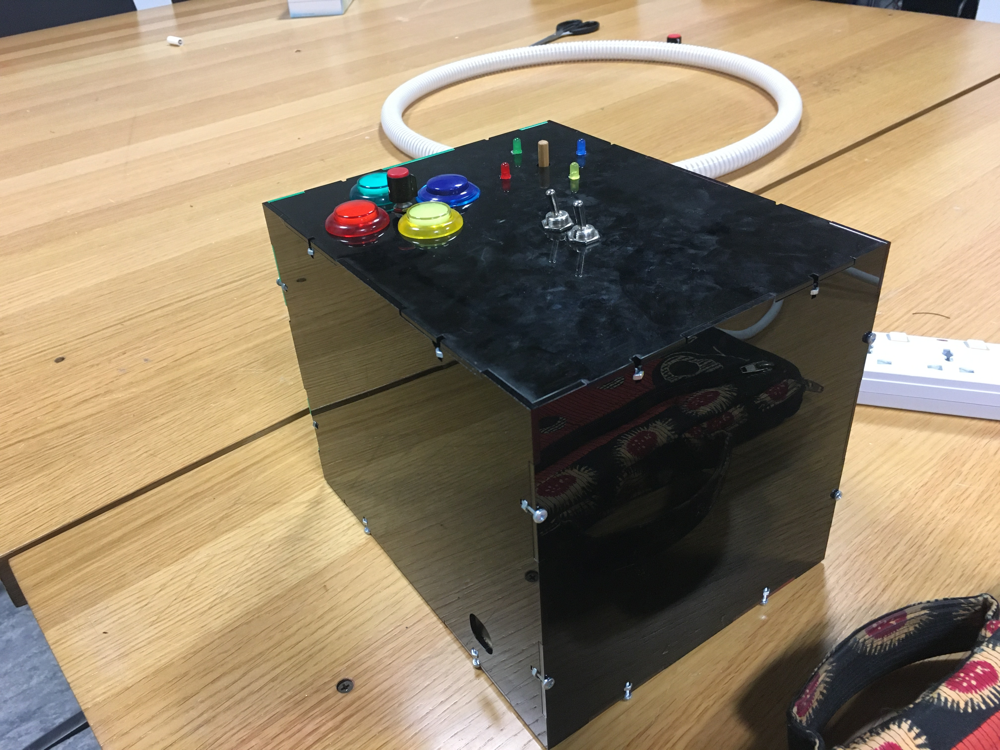
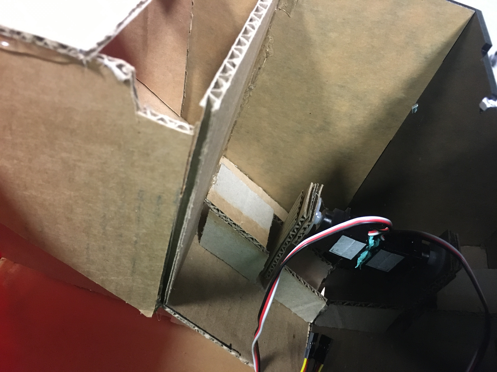
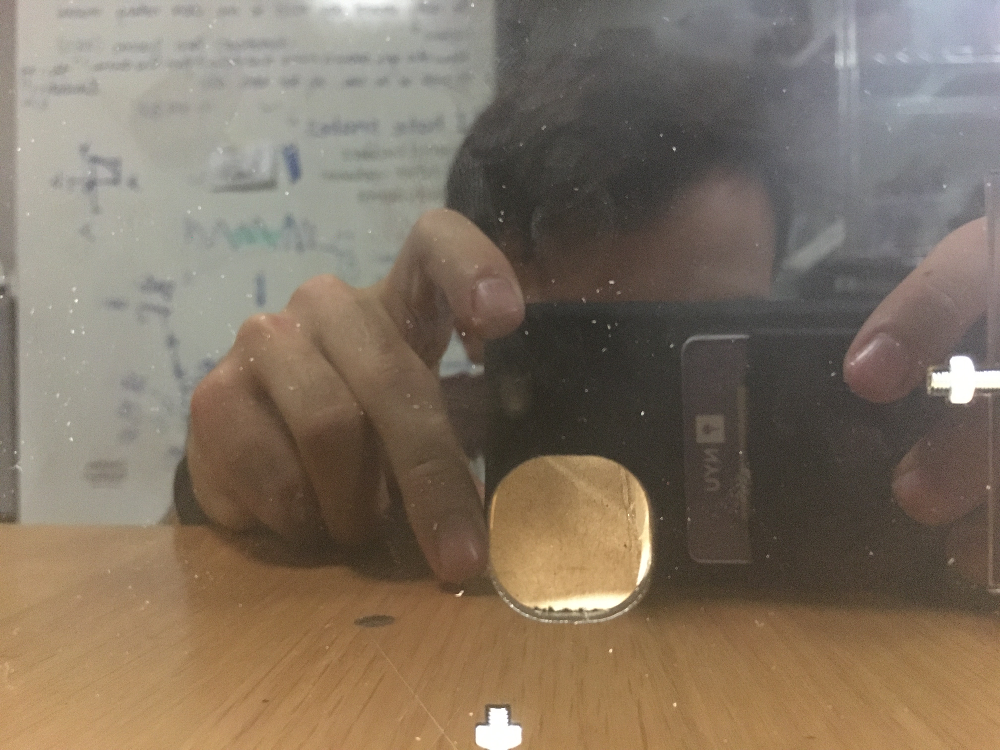
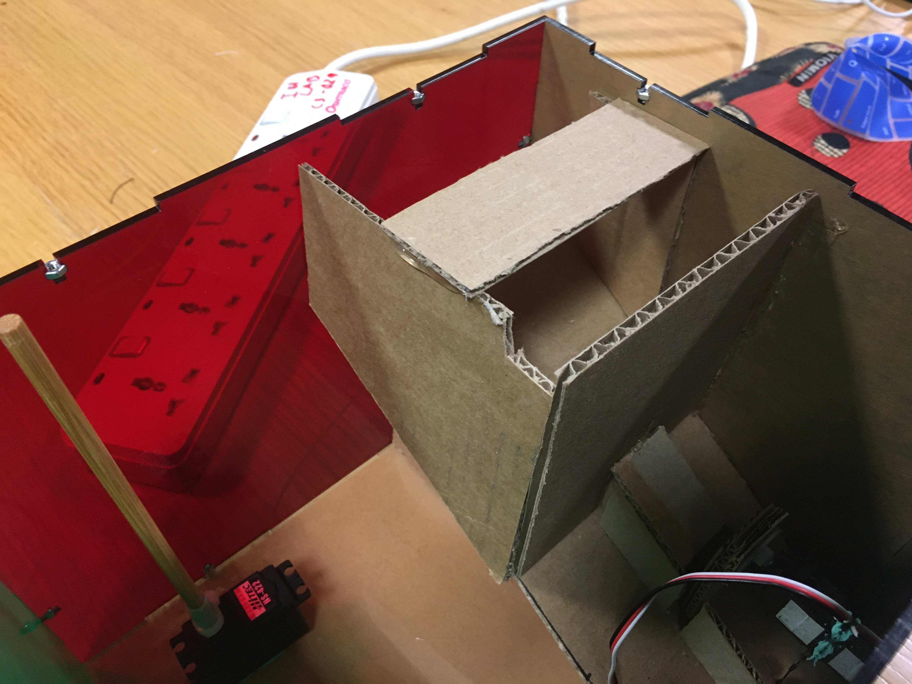
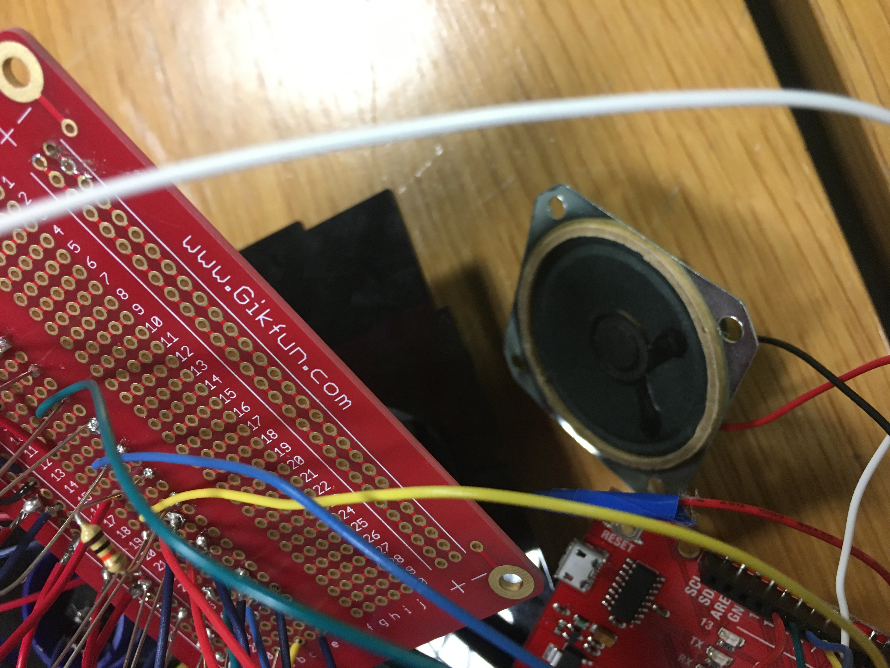
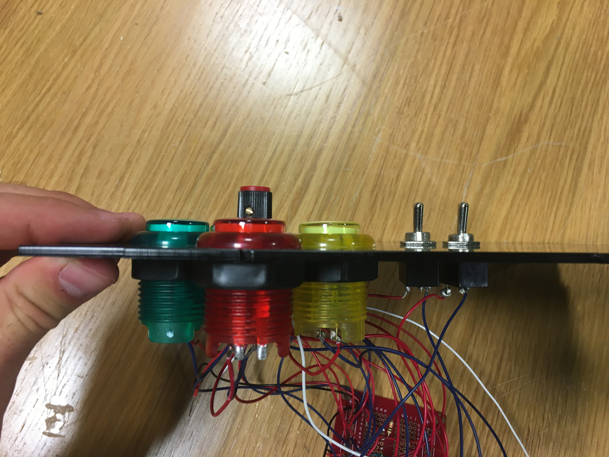
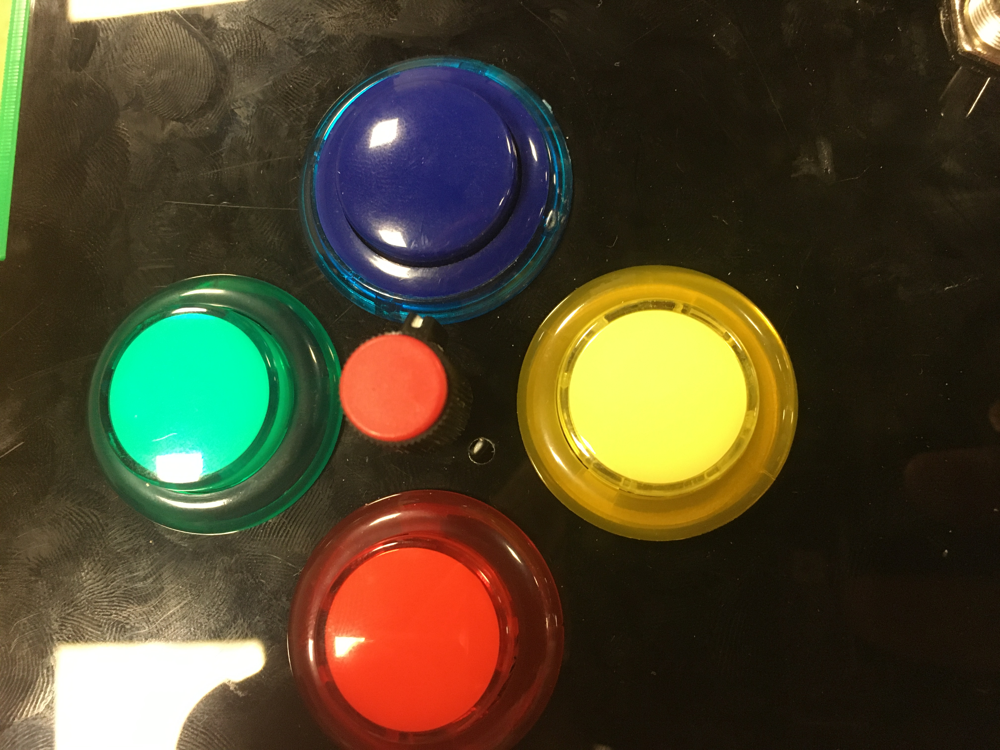

# Midterm Project: _M&Ms Memory Game!_

## Original Idea for Project

My original concept was simple: a tactile memory game that would incorporate multiple LED outputs and inputs, and provide some kind of reward if the user wins the game. I wanted to have a setup of four buttons (different colors) and a potentiometer on a box, and opposite to this four LEDs (of corresponding color) and a servo-controlled potentiometer head. The LED's flash and the potentiomenter turns in a randomized pattern. If the user mimics the pattern correctly, M&Ms come out of a hole in the side of the box. This is enabled with a servo that sweeps a small gate open and then shut. There is also a fast-slow switch and an on-off switch on top of the box.

## Getting Started

I started by making a practice run using four LEDs, four buttons and the breadboard that came with our kits. I set up the circuit and then wrote the code. The code essentially made a randomized array of numbers between 10 and 13 of a preset length, and then flashed the LEDs connected to the corresponding pins. If you clicked the right buttons, it would make all the LEDs flash, meaning you got it right. If you didn't get the input right only the red LED would flash. 

I split the code into three sections or "modes". I had a variable called mode and it was either 0, 1 or 2. Three if statements would activate certain parts of the loop function if the mode was correct. This allowed me to loop through specific parts of the code exclusively.

## Problems and Solutions

I decided that with this preparation, I was ready to start making my box to house the M&Ms and all electronic components. I first shooped around for pieces that I could make a box out of, but nothing seemed effective enough. I wanted to use wood, but there wasn't quality enough wood around to use. I decided to laser-cut a box, and I used large pieces of scrap acrylic to make a T-joint box with holes of the right size to fit my components.

I gathered all the buttons, switches, LEDs and one potentiometer, and I then began soldering a breadboard to convert my solderless design into a soldered product. This took incredibly long, especially because I was using threaded core wire which was hard to solder. I attached everything to the components. One of the problems was that my potentiometer didn't fit between the four buttons, so I had to cut part of it to the right shape.

After finishing the breadboard I ran into a huge problem - nothing was working and my speaker inside kept saying the input was wrong even though I hadn't inputted anything. This was because I hooked up the LED part of the push buttons instead of the buttons themselves, so I had to undo each soldered button and re-solder it in the right position.

Making the M&M housing unit was super simple, but it took a long time to figure out how I wanted the gate to open and close. The servo I wanted to use kept moving when the Arduino started up, so I tried to use a solenoid. I soldered the circuit with a transistor and everything, but it didn't work possibly because my voltage wasn't high enough. I decided to use the servo and call the few M&Ms that came out at the start a "feature", not a bug. 

## Current Prototype

Youtube video [Here](https://youtu.be/CkLPHmC3wF0)

Everything works as intended, but the servo and potentiometer input don't because I didn't have enough time to do testing and calibration with them. 

## Evaluation and Extensions 

I really really wanted to do a few things:

1) Take the speaker and attach it to the lid of the box, with a few holes, so we can actually hear it
2) Use a breadboard shield connector with the Arduino so that the pins don't fall out
3) Fix the M&M holder so that they don't get stuck as easily
4) Actually implement the potentiometer input and servo output
5) Make the array size dynamic between 6 and 10 different outputs, so that it's not always the same length of things to memorize

These are all very do-able, I just didn't have the time, and I really regret this. I hope I can re-visit it at some point when I have time and make it very nice. However, I did have time to do what was done properly, to the extent of my knowledge. For example, the potentiometer and switches were both put in with the little thing that pokes out so that it doesnt twist or move around on the lid.

## Circuit Diagram

## Some Images

### M&M Gate:

### M&M Output hole:

### M&M Housing Unit:

### Speaker and Breadboard:

### Input/Output Panel (Lid):

### Buttons with Potentiometer:

