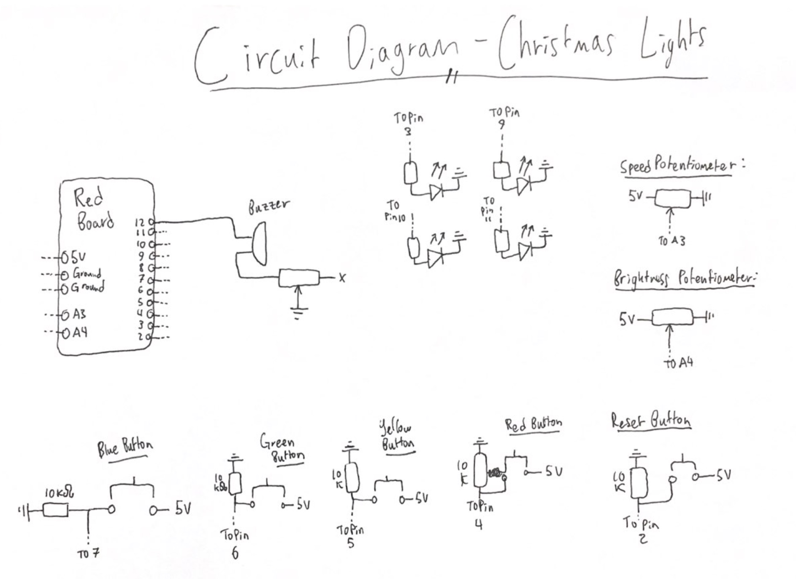
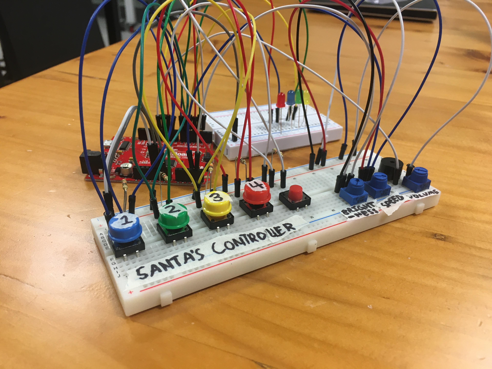
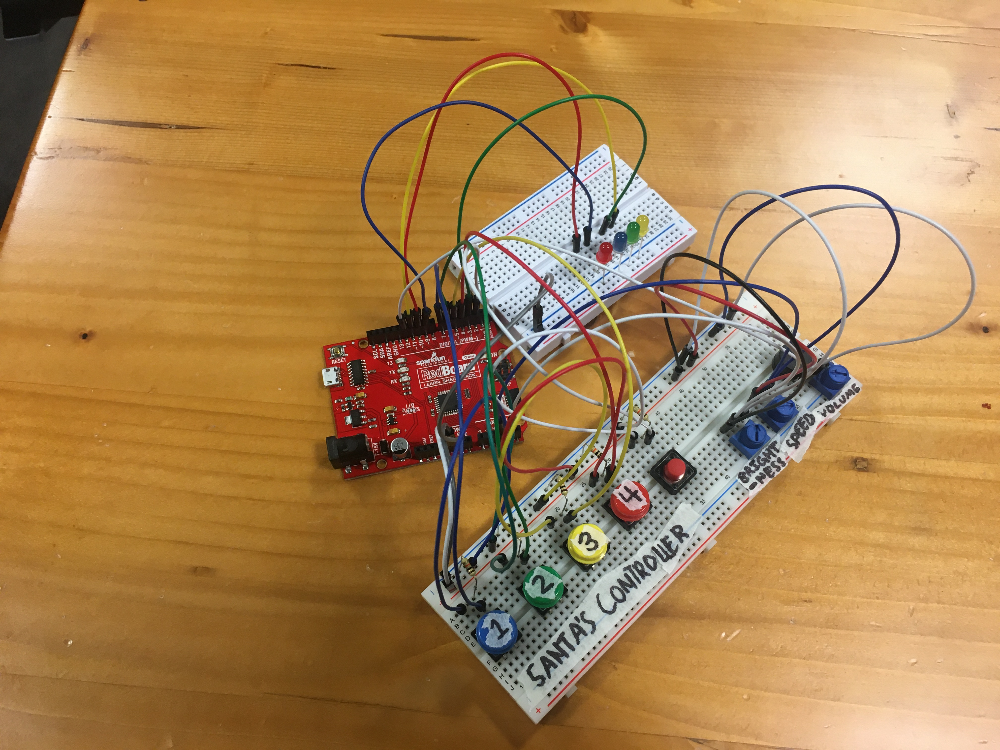

# Christmas Lights

## Description:

The story is this: Santa Claus is irritated with his elves. They keep changing the christmas light settings. So he decides to put a password in so that only he has access to the controlls to change the settings.

The concept is, you have four buttons, each numbered from 1 to 4, plus a reset button. You type in the passcode and then press the reset button, and then if the code is right you can adjust the settings for the Christmas lights. Otherwise you have to try again. 

I made it using two potentiometers for speed and brightness of the LED's, and I used a string to store the "real" password and one to store a string of whatever is inputted. These are compared when the reset button is pressed, and then if it's correct you're in. Otherwise you have to try again. Size of password only limited to max string size.

### Circuit Diagram:

### Some Images:

